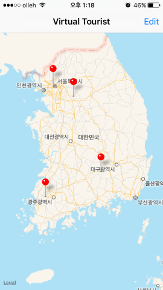
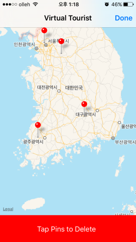
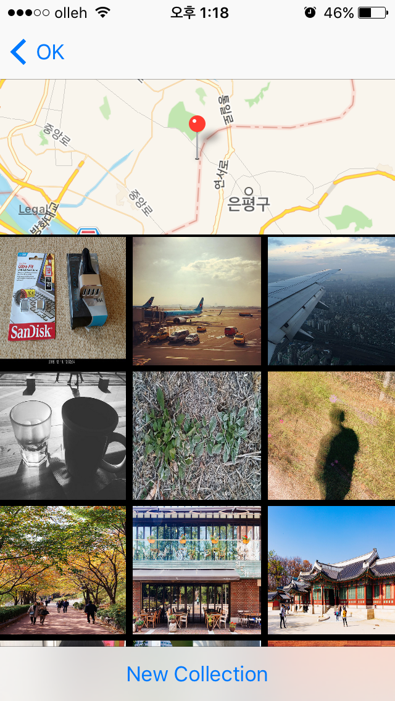
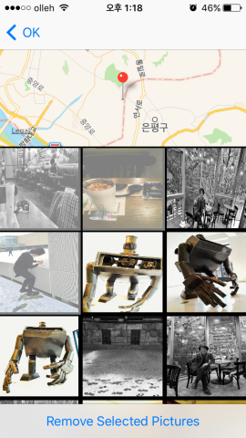

# VirtualTourist 
This app allows users to tour the world without leaving the comforts of their couch. The app enables you to drop pins on a map and pull up Flickr images associated with that location. Locations and images are stored by using Core Data Stack. 

# Features 

* Users can drop the pin on the map where they want to virtually explore through the picture albums. They can delete the pin if they lose interest in the place where the pin is located. 


 


* When users tap a pin, the app changes the screen and displays pictures downloaded from Flickr. Users can simply delete any picture by tapping it on the screen. What is more, they are able to see another set of pictures by pushing the 'New Collection' button on the bottom of the screen. 




* The pin is draggable so that users can locate their pins wherever they want. 
* Pictures are renewed every time users select the 'New Collection' button.
* Once pictures are downloaded, they are permanently saved on the application. 

# How to build 

1) Clone the repository 
```
$ git clone https://github.com/woogii/VirtualTourist.git
$ cd VirtualTourist
```
2) Open the workspace in XCode 
```
$ open VirtualTourist.xcodeproj/
```
3) Add your flick API key in Secret.swift
```
// Add your API KEY to API_KEY constant variable  
let API_KEY = ""
```
4) Compile and run the app in your simulator 

# Compatibility 
The code of this project works in Swift2.0, Xcode 7.0 and iOS9 
